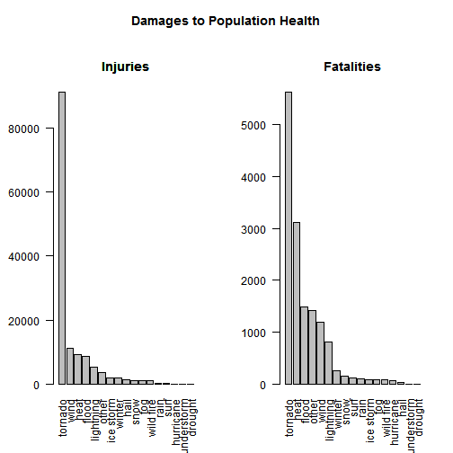
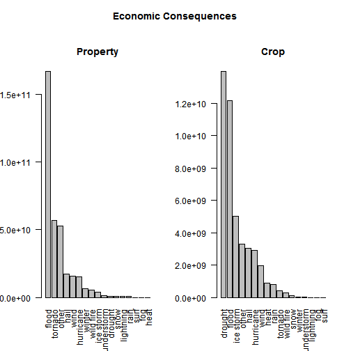

Weather Events Damage Analysis Report
========================================================
## 0 Synopsis
This is a report of the damage caused by severe weather events in the U.S.   based on the data provided by U.S. National Oceanic and Atmospheric Administration's (NOAA) storm database. The NOAA database tracks characteristics of major storms and weather events in the United States, including when and where they occur, as well as estimates of any fatalities, injuries, and property damage.

This report analyses what types of weather events caused the most damage with respect to popuulation health as well as economic consequences. The damages to population health and ecnomic consequences caused by varies weather events are exponentially distributed. Most injuries and fatalities were caused by tornados. Most property damages were caused by floods, and most crop damages were caused by droughts.

## 1 Data Processing

* The data is unziped and placed in the working directory and read into R using read.csv()
* Variable names were make clean by removing sysmbols and converted to lowercases
* The values for event type variable "evtype" are cleaned by:
  1. Remove irregular symbols
  2. Remove values shorter than 3 characters
  3. Remove values started with "summary"
  4. Consolidate values for the same weather event, for example change "heavy rain" to "rain"
  5. Label moinor weather events as "other"
* The values for damages are calculated and stored as new variable "propdamge" and "cropdamge"

### 1.1 Set Environment Variables
I am working on a Chinese version windows machine, need to do this before hand.

```r
Sys.setlocale("LC_TIME", "English")
```

```
## [1] "English_United States.1252"
```

```r
Sys.setlocale("LC_COLLATE", "English")
```

```
## [1] "English_United States.1252"
```

```r
Sys.setlocale("LC_CTYPE", "English")
```

```
## [1] "English_United States.1252"
```

```r
Sys.setlocale("LC_MONETARY", "English")
```

```
## [1] "English_United States.1252"
```

### 1.2 Load in Data

```r
data <- read.csv("repdata-data-StormData.csv", header = T)
# make variable names nicer
names(data) <- tolower(names(data))
names(data) <- gsub("_", "", names(data))
```

### 1.3 Clean the event type values
According to the dataset [documentation](https://d396qusza40orc.cloudfront.net/repdata%2Fpeer2_doc%2Fpd01016005curr.pdf) the event name should be one of those fifty listed.

```r
# make values nicer
data$evtype <- tolower(as.character(data$evtype))
data$evtype <- gsub("^(([^:]+)://)?([^:/]+)(:([0-9]+))?(/.*)", "", data$evtype)
# remove values that are too short to be valid
data <- subset(data, nchar(data$evtype) >= 2)
# remove values starts with 'summary'
data$evtype[grep("summary", data$evtype)] <- "tbm"
data <- subset(data, data$evtype != "tbm")
# consolidate values of weather events
data$evtype[grep("hail", data$evtype)] <- "hail"
data$evtype[grep("wind", data$evtype)] <- "wind"
data$evtype[grep("tornado", data$evtype)] <- "tornado"
data$evtype[grep("flood", data$evtype)] <- "flood"
data$evtype[grep("lightning", data$evtype)] <- "lightning"
data$evtype[grep("snow", data$evtype)] <- "snow"
data$evtype[grep("rain", data$evtype)] <- "rain"
data$evtype[grep("winter", data$evtype)] <- "winter"
data$evtype[grep("heat", data$evtype)] <- "heat"
data$evtype[grep("fog", data$evtype)] <- "fog"
data$evtype[grep("surf", data$evtype)] <- "surf"
data$evtype[grep("ice storm", data$evtype)] <- "ice storm"
data$evtype[grep("fire", data$evtype)] <- "wild fire"
data$evtype[grep("storm surge", data$evtype)] <- "strom surge"
data$evtype[grep("hurricane", data$evtype)] <- "hurricane"
data$evtype[grep("drought", data$evtype)] <- "drought"
data$evtype[grep("thunderstorm", data$evtype)] <- "thunderstorm"
```

These major weather event types takes up 97.8% of all observations  
The rest 3.2% weather events are changed into "other" catogery

```r
sum(data$evtype %in% c("flood", "wind", "snow", "tornado", "hail", "rain", "lightning", 
    "winter", "fog", "heat", "surf", "ice storm", "wild fire", "storm surge", 
    "hurricane", "drought", "thunderstorm"))/nrow(data)
```

```
## [1] 0.9778
```

```r

tbc <- data$evtype %in% c("flood", "wind", "snow", "tornado", "hail", "rain", 
    "lightning", "winter", "heat", "surf", "fog", "ice storm", "wild fire", 
    "storm surge", "hurricane", "drought", "thunderstorm") == F
data$evtype[tbc == T] <- "other"
```


Summary of counts of cleaned event type values

```r
sort(table(data$evtype))
```

```
## 
## thunderstorm    hurricane         surf          fog    ice storm 
##           92          199          833         1883         2006 
##      drought         heat    wild fire         rain    lightning 
##         2488         2630         2781        12136        15762 
##         snow       winter        other      tornado        flood 
##        17569        18492        19813        60688        81967 
##         hail         wind 
##       289338       362164
```

### 1.4 Calculating Damages

```r
# make damage unit values nicer
data$propdmgexp <- as.character(data$propdmgexp)
data$propdmgexp[grep("K", data$propdmgexp)] <- "1000"
data$propdmgexp[grep("M", data$propdmgexp)] <- "1000000"
data$propdmgexp[grep("m", data$propdmgexp)] <- "1000000"
data$propdmgexp[grep("B", data$propdmgexp)] <- "1000000000"
tbc <- data$propdmgexp %in% c("1000", "1000000", "1000000000") == F
data$propdmgexp[tbc == T] <- "1"
data$propdmgexp <- as.numeric(data$propdmgexp)
# do the same thing to cropdmg
data$cropdmgexp <- as.character(data$cropdmgexp)
data$cropdmgexp[grep("K", data$cropdmgexp)] <- "1000"
data$cropdmgexp[grep("M", data$cropdmgexp)] <- "1000000"
data$cropdmgexp[grep("m", data$cropdmgexp)] <- "1000000"
data$cropdmgexp[grep("B", data$cropdmgexp)] <- "1000000000"
tbc <- data$cropdmgexp %in% c("1000", "1000000", "1000000000") == F
data$cropdmgexp[tbc == T] <- "1"
data$cropdmgexp <- as.numeric(data$cropdmgexp)
```

Calculating and stored damages as new variable "propdamge" and "cropdamge"

```r
data$propdamage <- data$propdmg * data$propdmgexp
data$cropdamage <- data$cropdmg * data$cropdmgexp
```


## 2 Results  
### 2.1 Damages to Popuulation Health
* Injuries: Tornado is the cause for most the injuries(66.1%) among all weather events. The top three weather events responsible for over 80% injuries in the dataset are: tornado, wind and heat.  
* Fatalities: Tornado is agin the cause for most the fatalities (38.4%). The top three weather events responsible for about 70% fatalities in the dataset are: tornado, heat, and flood.


```r
# The event that caused most injuries
totalInjuries <- tapply(data$injuries, data$evtype, sum)
sort(totalInjuries, decreasing = T)[1]
```

```
## tornado 
##   91365
```

```r
# the percentage of injuries caused by the tornado
sum(sort(totalInjuries, decreasing = T)[1])/sum(totalInjuries)
```

```
## [1] 0.661
```

```r
# The top 3 events casuing most injuries
sort(totalInjuries, decreasing = T)[1:3]
```

```
## tornado    wind    heat 
##   91365   11319    9224
```

```r
# the percentage of injuries caused by the top 3 weather events
sum(sort(totalInjuries, decreasing = T)[1:3])/sum(totalInjuries)
```

```
## [1] 0.8096
```

```r
# The event that caused most fatalities
totalFatal <- tapply(data$fatalities, data$evtype, sum)
sort(totalFatal, decreasing = T)[1]
```

```
## tornado 
##    5633
```

```r
# the percentage of fatalities caused by the tornado
sum(sort(totalFatal, decreasing = T)[1])/sum(totalFatal)
```

```
## [1] 0.3846
```

```r
# The top 3 events casuing most fatalities
sort(totalFatal, decreasing = T)[1:3]
```

```
## tornado    heat   flood 
##    5633    3119    1488
```

```r
# the percentage of death caused by the top 3 weather events
sum(sort(totalFatal, decreasing = T)[1:3])/sum(totalFatal)
```

```
## [1] 0.6992
```


### 2.2 Economic Consequences
* Porperty Damage: Flood is the cause for most porperty damages(48%) among all weather events. Flood and tornado together are responsible for about 65% of all porperty damages.
* Crop Damage: Drought is the cause for most crop damages(31%) among all 
weather events. Drought, flood and ice storm together are responsible for over 69% of all crop damages.


```r
# The event that caused most porperty damages
totalPropDamage <- tapply(data$propdamage, data$evtype, sum)
sort(totalPropDamage, decreasing = T)[1]
```

```
##    flood 
## 1.67e+11
```

```r
# the percentage of porperty damages caused by flood
sort(totalPropDamage, decreasing = T)[1]/sum(totalPropDamage)
```

```
##  flood 
## 0.4814
```

```r
# top 2 weather events causing the most porperty damages
sort(totalPropDamage, decreasing = T)[1:2]
```

```
##     flood   tornado 
## 1.670e+11 5.694e+10
```

```r
# percentage of total porperty damages caused by thetop 2 weather events
sum(sort(totalPropDamage, decreasing = T)[1:2])/sum(totalPropDamage)
```

```
## [1] 0.6456
```

```r
# The event that caused most crop damages
totalCropDamage <- tapply(data$cropdamage, data$evtype, sum)
sort(totalCropDamage, decreasing = T)[1]
```

```
##   drought 
## 1.397e+10
```

```r
# the percentage of crop damages caused by drought
sort(totalCropDamage, decreasing = T)[1]/sum(totalCropDamage)
```

```
## drought 
##  0.3106
```

```r
# top 3 weather events causing the most crop damages
sort(totalCropDamage, decreasing = T)[1:3]
```

```
##   drought     flood ice storm 
## 1.397e+10 1.217e+10 5.022e+09
```

```r
# percentage of total porperty damages caused by the top 3 weather events
sum(sort(totalCropDamage, decreasing = T)[1:3])/sum(totalCropDamage)
```

```
## [1] 0.6927
```


### Figure 1: Damages to Population Health

```r
par(oma = c(0, 0, 3, 0))
par(las = 2)
par(mfcol = c(1, 2))
barplot(sort(totalInjuries, decreasing = T), main = "Injuries")
title("Injuries")
barplot(sort(totalFatal, decreasing = T), main = "Fatalities")
title("Damages to Population Health", outer = T)
```

 


### Figure 2: Economic Consequences 

```r
par(oma = c(0, 0, 3, 0))
par(las = 2)
par(mfcol = c(1, 2))
barplot(sort(totalPropDamage, decreasing = T), main = "Property")
barplot(sort(totalCropDamage, decreasing = T), main = "Crop")
title("Economic Consequences", outer = T)
```

 

